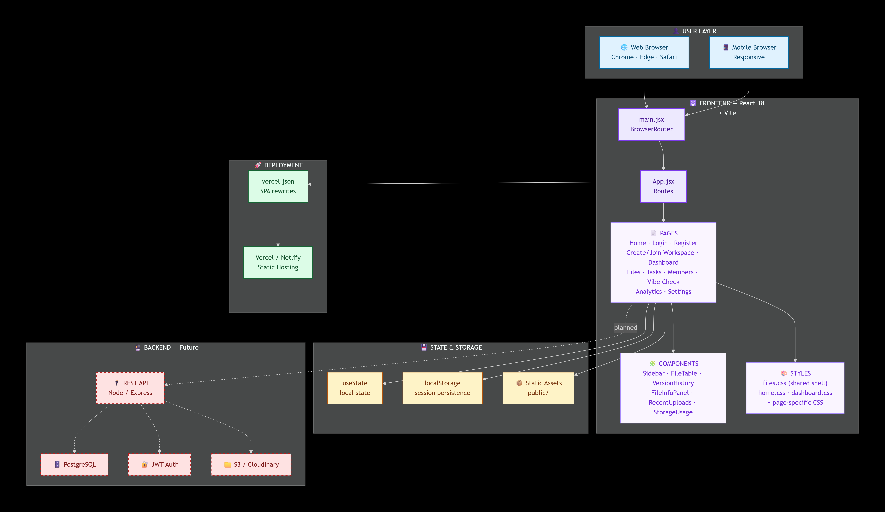
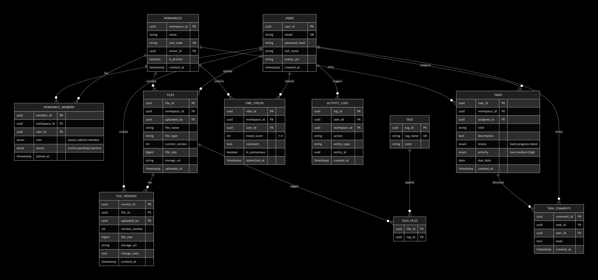
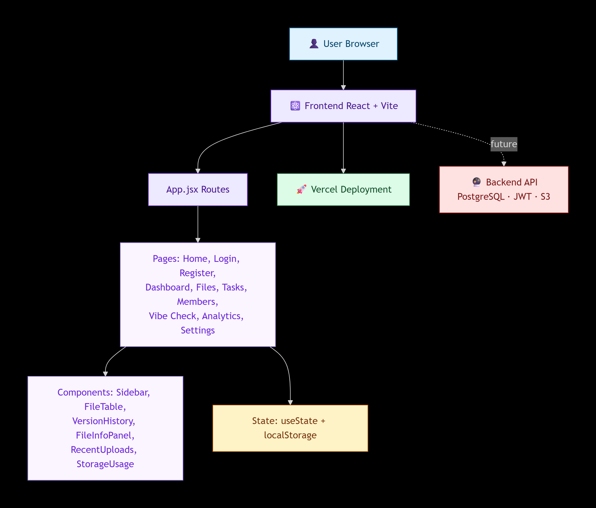

# 🔷 SyncTask

> A collaborative project management platform for student teams and IT project groups — monitor contributions, track file versions, manage tasks, and keep every member accountable.

---

## 📖 Table of Contents

- [About](#-about)
- [Features](#-features)
- [Tech Stack](#-tech-stack)
- [System Architecture](#-system-architecture)
- [Database / ERD](#-database--erd)
- [Sitemap](#-sitemap)
- [Project Structure](#-project-structure)
- [Getting Started](#-getting-started)
- [Available Scripts](#-available-scripts)
- [Routes](#-routes)
- [Roadmap](#-roadmap)
- [Contributing](#-contributing)
- [Team](#-team)
- [License](#-license)

---

## 📌 About

**SyncTask** is a web-based project management tool built for **students, startups, and IT project teams**. It solves the common problem of "someone isn't contributing" by:

- Automatically **tracking file versions** every time a member re-uploads
- Running a **fair task lottery** that assigns cleanup work to inactive members
- Visualizing **team activity** and **contribution scores** in real time
- Enabling **vibe checks** so teams can share how they're feeling

> Built as a capstone project — Phase 2: Define.

---

## ✨ Features

### 📁 File Management
- Drag & drop file uploads
- Automatic versioning (`v1`, `v2`, `v3` …)
- File info panel — owner, size, location, tags
- Full version history with timestamps
- Storage usage breakdown

### ✅ Task Management
- Kanban board — To Do · In Progress · Done
- Automatic cleanup task lottery for inactive members
- Overdue task alerts
- Task assignments with due dates and priorities

### 👥 Team Collaboration
- Member activity monitor
- Inactive member detection
- Invite via workspace code
- Team performance rating
- Real-time notification feed

### ◔ Vibe Checks
- Emoji-based mood tracking
- Anonymous submission option
- Team feedback feed

### 📊 Analytics
- Team activity over time (line chart)
- Per-member contribution bars
- Deadline calendar
- Workflow insights

### 🏠 Dashboard
- Welcome overview with 4 stat cards
- Project flow visualization (9 stages)
- Recent project files
- Upcoming deadlines
- Task assignments summary

---

## 🛠️ Tech Stack

| Layer | Technology |
|-------|-----------|
| **Framework** | React 18 |
| **Build Tool** | Vite 5 |
| **Routing** | React Router DOM v6 |
| **Styling** | Plain CSS (7 stylesheets) |
| **State** | React Hooks (`useState`) |
| **Package Manager** | npm |
| **Deployment** | Vercel / Netlify *(planned)* |
| **Backend** | Node + Express *(planned)* |
| **Database** | PostgreSQL *(planned)* |
| **Auth** | JWT *(planned)* |

---

## 🏗️ System Architecture

### Layers

| Layer | Responsibility |
|-------|---------------|
| 👤 **User** | Access via web browser (Chrome, Edge, Safari) |
| ⚛️ **Frontend** | React SPA — routing, pages, components, styling |
| 💾 **State** | Local component state (`useState`) + mock data |
| 🚀 **Deployment** | Static hosting on Vercel / Netlify with SPA rewrites |
| 🔮 **Backend** *(planned)* | REST API, PostgreSQL, JWT auth, S3 file storage |

---

## 🗄️ Database / ERD

### Entities

| Table | Description |
|-------|-------------|
| `users` | Registered members |
| `workspaces` | Project workspaces |
| `workspace_members` | User ↔ Workspace (many-to-many with roles) |
| `files` | Uploaded files (current version pointer) |
| `file_versions` | Every version of every file |
| `tags` | Reusable tags |
| `tags_files` | File ↔ Tag (many-to-many) |
| `tasks` | Task items with status/priority |
| `task_comments` | Comments on tasks |
| `vibe_checks` | Mood submissions |
| `activity_logs` | Audit trail |

### Key Relationships

- `users` **1:N** `files` — a user uploads many files
- `files` **1:N** `file_versions` — a file has many versions
- `workspaces` **1:N** `tasks` — a workspace owns many tasks
- `workspaces` **N:M** `users` — via `workspace_members`
- `files` **N:M** `tags` — via `tags_files`

---

## 🗺️ Sitemap

